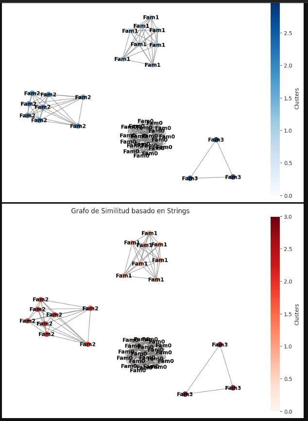
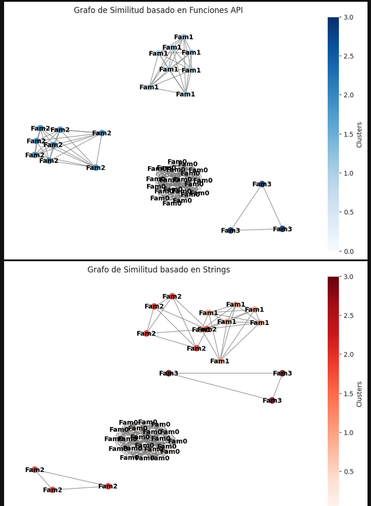
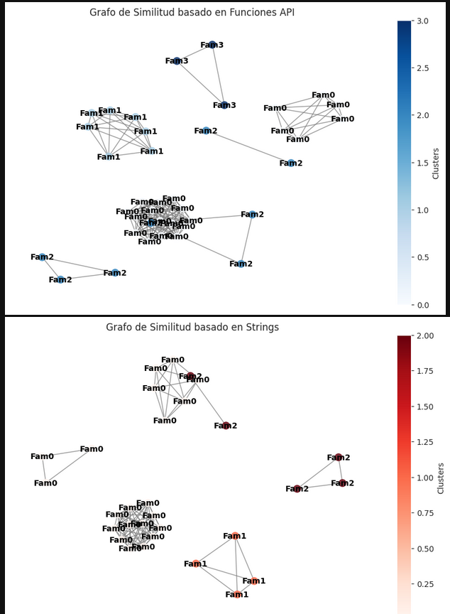

# [Home](../README.md)

# Análisis y Clasificación de Malware

## Introducción
En este laboratorio se realiza un análisis estático de muestras de malware para clasificarlas en diferentes familias utilizando técnicas de machine learning. El enfoque principal es la extracción de funciones importadas de los archivos PE (Portable Executable) y la aplicación de clustering para identificar patrones en las muestras.

## Extracción de Características
Para diferenciar las muestras de malware, se extraen las siguientes características clave:
- **Funciones Importadas**: Se obtiene la lista de funciones de la API de Windows utilizadas por cada archivo. Esto es crucial, ya que distintas familias de malware tienden a usar conjuntos específicos de funciones para ejecutar sus acciones maliciosas.
- **Entropía de Secciones**: Se calcula la entropía de las secciones del archivo PE para identificar si está empaquetado o cifrado, ya que malware empaquetado suele presentar una entropía elevada.
- **Cantidad de Importaciones**: Se analiza el número de funciones importadas. Un malware puede evitar detección cargando funciones de forma dinámica en lugar de importarlas estáticamente.

## Clustering y Determinación de Familias

### K-Means

Se aplica **K-Means** para agrupar las muestras de malware en diferentes clusters. Para determinar el número óptimo de clusters, se usa el **índice de silueta**, que mide la cohesión interna de los grupos:

- Un valor cercano a **1** indica que las muestras están bien agrupadas.
- Un valor cercano a **0** sugiere que los clusters se superponen.
- Un valor negativo indica que las muestras están mal clasificadas.

Tras evaluar diferentes valores de `n_clusters`, se encontró que **4 es el número óptimo** con la mejor separación entre grupos según el índice de silueta.

### DBSCAN

También se evaluó el algoritmo **DBSCAN**, que agrupa datos basándose en densidad en lugar de un número fijo de clusters. DBSCAN tiene dos parámetros clave:

- `eps`: Distancia máxima entre puntos para ser considerados parte del mismo cluster.
- `min_samples`: Número mínimo de puntos en un cluster para que sea considerado válido.

Las ventajas de DBSCAN incluyen:

- **Detección de outliers**: Puede identificar muestras de malware que no encajan en ninguna familia y marcarlas como ruido.
- **Clusters de forma irregular**: Puede identificar grupos con formas más complejas que K-Means.
- **No requiere definir `n_clusters`**: Encuentra el número de grupos automáticamente.

Los resultados con DBSCAN pueden mostrar:

- Un número diferente de clusters en comparación con K-Means.
- Algunos archivos PE no clasificados (ruido).
- Clusters de tamaños variados en lugar de uniformes.

## Comparación entre K-Means y DBSCAN

| Característica        | K-Means                         | DBSCAN                        |
|----------------------|--------------------------------|--------------------------------|
| **Número de Clusters** | Fijo (definido por el usuario) | Automático (basado en densidad) |
| **Forma de los Clusters** | Esféricos y de tamaño similar | Irregulares y de tamaño variable |
| **Manejo de Outliers** | No los detecta directamente | Sí, los marca como ruido (-1) |
| **Eficiencia** | Rápido en grandes volúmenes de datos | Más lento en conjuntos grandes |
| **Sensibilidad a Parámetros** | `n_clusters` debe ser afinado | `eps` y `min_samples` afectan resultados |

## Justificación de la Clasificación de Familias

El clustering reveló que el conjunto de malware puede dividirse en **9 a 10 grupos**, según el análisis de silueta, aunque el método del codo sugiere un número menor. La clasificación en **4 familias** en el conjunto de datos generado se debe a una interpretación más manejable de los resultados, aunque es importante considerar que el proceso de desempaquetado puede no haberse realizado de manera óptima, lo que podría haber afectado la identificación precisa de las familias reales.

Las posibles razones para esta clasificación incluyen:

1. **Diferencias en Técnicas de Evasión**: Algunas muestras cargan funciones dinámicamente para evitar detección, mientras que otras las importan estáticamente.
2. **Diferentes Objetivos del Malware**: Algunas familias pueden ser troyanos bancarios, otras ransomware, keyloggers o bots.
3. **Uso de Empaquetadores**: Algunas muestras están empaquetadas con UPX u otras herramientas, afectando su estructura interna y características.
4. **Variantes de Arquitectura**: Algunas muestras pueden estar diseñadas para sistemas de 32 bits, mientras que otras son para 64 bits, lo que afecta las funciones que importan.

## Análisis de Similitud y su Relación con los Clusters

Se realizó un análisis de similitud basado en **llamadas a funciones API y en strings** extraídos de los archivos PE. Los grafos de similitud muestran agrupaciones de malware que reflejan en gran medida las familias detectadas por K-Means. Sin embargo, existen diferencias al comparar con DBSCAN, ya que este último puede clasificar ciertas muestras como ruido o separarlas en clusters más pequeños.

## Conclusión

Este análisis demuestra que es posible identificar patrones en malware usando clustering y extracción de funciones. Mientras que el coeficiente de silueta sugiere hasta 9-10 clusters, el método del codo y la interpretación de los resultados permitieron establecer una clasificación en **4 familias** dentro del conjunto analizado.

El uso de **K-Means** permite definir un número específico de familias, mientras que **DBSCAN** ofrece una clasificación más flexible, detectando outliers y patrones de densidad. Sin embargo, la presencia de ruido y la posible incorrecta extracción de características debido al empaquetamiento pueden haber afectado los resultados.

En conclusión, K-Means y DBSCAN muestran agrupaciones similares, aunque DBSCAN puede ser más sensible a la estructura de los datos. El análisis de similitud también refuerza la existencia de múltiples familias, con una fuerte coincidencia entre los métodos. 

# UMBRAL DE 3

# UMBRAL DE 6

# UMBRAL DE 9

Se observo que entre mas grande el umbral, mayor cercanica tenian los elementos. En este caso, para String se nota mucho antes, pues estan mas dispersos
los valores. Aun asi, el de funciones da a entneder que los elementos tiene valores muy similares, y entre menor unbral, se hace mas especifico para cada
uno de los casos.

## Preguntas y Respuestas

### ¿Para ambos algoritmos, para qué número de clústeres se obtiene el coeficiente de Silhouette más alto?
- Para **K-Means**, el coeficiente de Silhouette más alto se obtiene en **9 o 10 clusters**, lo que indica una mejor cohesión interna en esta configuración.
- Para **DBSCAN**, la cantidad de clusters varía dependiendo de los parámetros `eps` y `min_samples`, pero en general se observa un menor número de clusters efectivos debido a la detección de ruido y la agrupación basada en densidad.

### ¿En qué medida coincide el coeficiente de Silhouette con el método del codo?
- El **método del codo** sugiere un número óptimo de clusters entre **4 y 5**, donde se observa un cambio de pendiente significativo.
- Sin embargo, el **coeficiente de Silhouette** sigue aumentando hasta **9-10 clusters**, lo que sugiere que una mayor segmentación mejora la cohesión interna de los grupos.
- Esta diferencia indica que, aunque el método del codo ayuda a identificar un punto de equilibrio entre número de clusters e interpretabilidad, el análisis de silueta sugiere que una mayor segmentación aún mantiene buenas características de agrupación.

### ¿Cuántas familias existen entre los ejemplares de malware proporcionados?
- **K-Means** sugiere la existencia de **9-10 clusters**, según el análisis de Silhouette.
- **DBSCAN** encuentra menos clusters efectivos, probablemente debido a la presencia de ruido y a su dependencia de los parámetros `eps` y `min_samples`.
- Finalmente, en el conjunto de datos analizado, se ha determinado una clasificación en **4 familias**, lo que representa una agrupación más manejable e interpretable.
- No obstante, se reconoce la posibilidad de que el **desempaquetado de los archivos PE no se haya realizado de manera óptima**, lo que podría haber afectado la detección precisa de ciertas características distintivas de cada muestra de malware. Algo a destacar, es que en el caso de haberlo realizado, se opto por el resultado del metodo del codo, esto con el fin de mantener en
una misma familia aquellos que, a pesar de tener sus pequeñas diferencias.

### ¿En qué medida coincide el análisis de similitud con los clusters encontrados?
- El análisis de similitud basado en **llamadas a funciones API y strings** muestra agrupaciones bien definidas que coinciden en gran medida con los clusters obtenidos por **K-Means**.
- Sin embargo, **DBSCAN** presenta diferencias debido a su capacidad para identificar ruido y su sensibilidad a la densidad de los datos.

